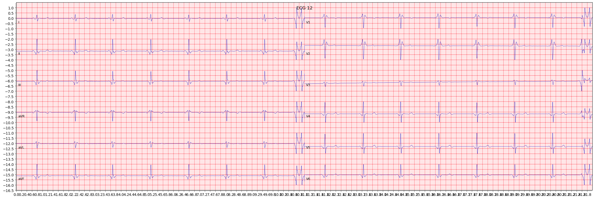

## Philips ECG Parser

Parses a Philips XML file by writing the output to a CSV file and saving the ECG waveform as a PNG.

Based on the [Sierra ECG Tools](https://github.com/sixlettervariables/sierra-ecg-tools) by Christopher Watford.

### Installation

Note that both a `requirements.txt` and conda `environment.yml` file to allow dependencies to be installed on a M1-based Mac.

```
conda create -n ecg python=3.8
conda activate ecg
conda env update --file environment.yml
pip install -r requirements.txt
```

### Usage

```
python3 parse_xml.py <ECG XML file> <output CSV> <output 12-lead ECG waveform>
```

### Example

Command:
```
python3 parse_xml.py ecg-example.xml output.csv output.png
```

`output.csv`
```
date,time,heartrate,rrint,pdur,qonset,tonset,qtint,qtcb,qtcf,QTcFM,QTcH,pfrontaxis,i40frontaxis,qrsfrontaxis,stfrontaxis,tfrontaxis,phorizaxis,i40horizaxis,t40horizaxis,qrshorizaxis,sthorizaxis,severity,statements
2008-12-23,19:44:46,41,1463,508,512,,564,466,497,,,19,75,85,72,53,48,-8,-46,-43,122,OTHERWISE NORMAL ECG,"SINUS BRADYCARDIA,NO PREVIOUS TRACING AVAILABLE FOR COMPARISON"
```

`output.png`

